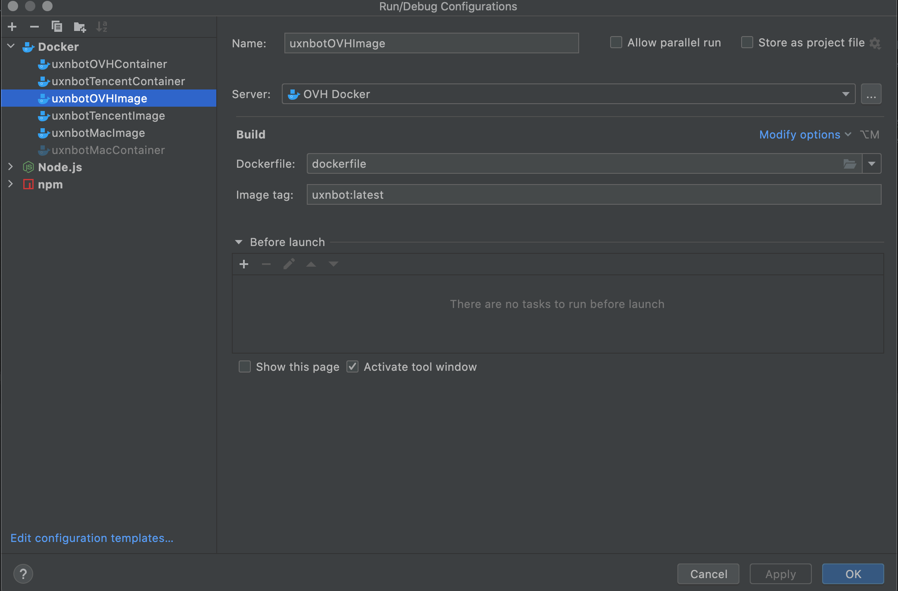
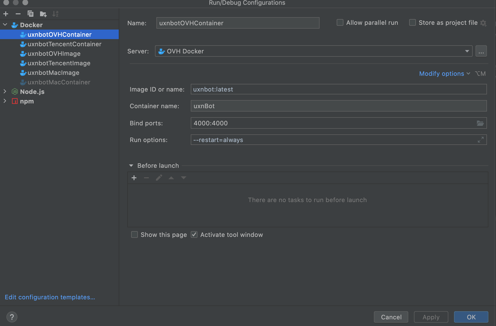
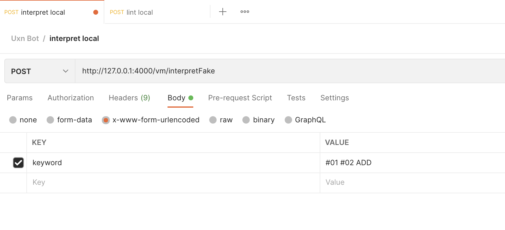
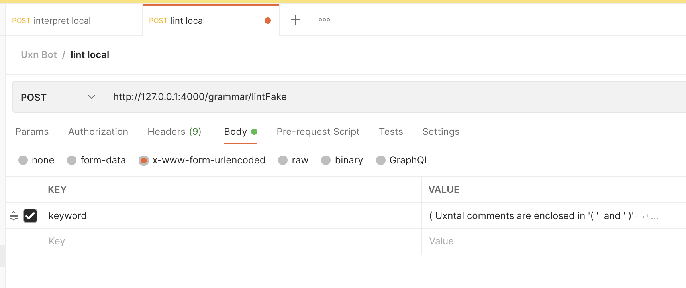

# UXN bot
Hello, this is the uxn bot backend for linter and interpreter modules, which handles the user's input and send back uxn virtual machine's results. 

You can try UXNBot directly at [UXNBot for web](https://openai.weixin.qq.com/webapp/uVylB0cwhfCHBWRnXqa2WrnZ9TE2KJ?robotName=Try%20Uxn%20Bot).

Or you can scan QRCode to try it on mobile phones.


# Install Yourself
This project is developed using IntelliJ WebStorm.

As the RESTFul requests are sent from WeChat Open Dialog Platform, it needs special parsing procedure.

The teaching module is not accessible as it need my WeChat account to scan QRCode to login.

But I made two fake api for you guys to try out linter and interpreter module!

Following the getting started section, you can use PostMan to test Fake POST Api of linter and interpreter modules.

# Getting Started - the docker way **Recommanded**
As the linter module has hard coded absolute path for node.js docker, this is the only way to make linter work without changing code.
- Install docker desktop from [Official Site](https://www.docker.com/).
- Import project using WebStorm.
- Build image in WebStorm using docker file with the following running configuration.
  
- Build Container using the following running configuration.
  
- Test apis on Postman

# Getting Started - the no docker way
- Import project using WebStorm.
- Download node.js from [Official Site](https://nodejs.org/en/download/).
- Download npm following [Official Docs](https://docs.npmjs.com/downloading-and-installing-node-js-and-npm).
- Download yarn from [Official Site](https://yarnpkg.com/getting-started/install).

Run the following command in WebStorm Terminal
```shell
yarn install
yarn serve
```
- Test apis on Postman
# POST api for POSTMAN- http://127.0.0.1:4000/vm/interpretFake


# POST api for POSTMAN - http://127.0.0.1:4000/grammar/lintFake


# Architecture
This project is using Express.js framework that built on node.js as our RESTFul backend service.
This project is using the language - javascript.

# Author
This project is conducted by YIXUAN RUAN as his 2022 Master Degree Project in the University of Glasgow.
This project is supervised by Prof Dr Wim Vanderbauwhede.

# Code Reference
Due to short project time-scale and unfamiliarity with Uxn VM,
Some code is directly used from other projects.
- The Uxn VM part of the code: [Github-XXIIVV-oscean](https://github.com/XXIIVV/oscean/tree/main/etc/unicycle)
- The Uxnlin part of the code: [UXNLin](https://git.sr.ht/~rabbits/uxnlin)